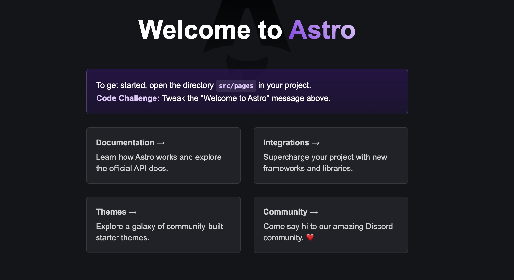
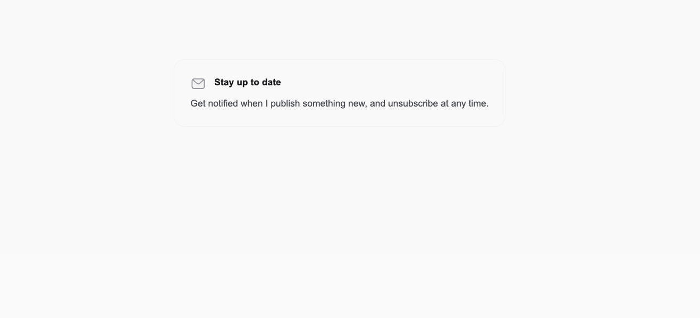
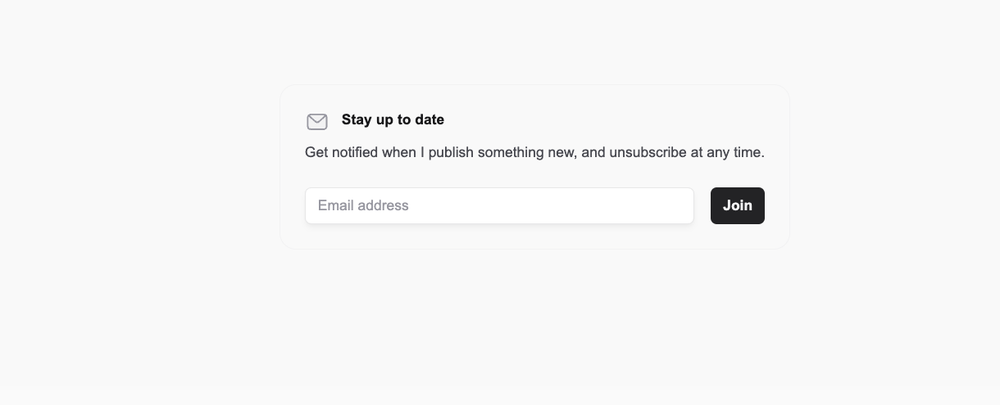
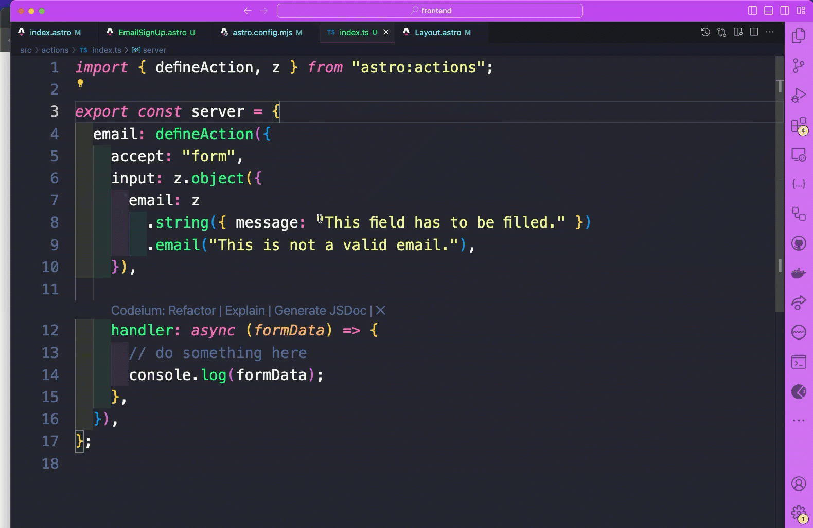

# Astro Actions With Vanilla JS and Strapi

Astro just recently released their Astro Actions, which is pretty awesome. In this tutorial we will take a look on how to create an email capture form that will will showcase this feature.

Here it is in action.


We will start by building out our Astro App and finally we will connected to Strapi 5, we will be using the release candidate.

## So Why Are We Using Astro?

Besides the fact that it is awesome.

Astro is a fantastic web framework for creating content-rich websites like blogs, marketing sites, and online stores.

It stands out by reducing the amount of JavaScript needed, making your site faster and easier to manage.

Astro's unique "Islands" architecture is designed specifically for content, ensuring your website loads quickly and performs well in search engine rankings.

It supports popular tools like React, Vue, and Svelte, offering great flexibility for developers.

Astro is super user-friendly, providing everything you need to build a website in one place, along with many integrations to customize your site.

Even if you're not a coding expert, Astro's HTML-based syntax is easy to learn and use.

Astro makes it easy to create high-quality, fast-loading websites, making it a top choice for anyone looking to build an impressive online presence.

And it is a great way to create site with just vanilla js/ts, html and css.

And that is what we are going to do in this tutorial.

Use Astro without any additional frameworks. That is right, we will write vanilla js/ts.

## Setting Up Our Astro Project

You can find all the details [here](https://docs.astro.build/en/install-and-setup) but we are going to start with this simple command:

note: but first create a folder where you will want to store this project on your local computer.

```bash
  npm create astro@latest
```

You will be asked couple of questions, starting where you would like to create your app. I will created in the root of my current folder and call it `frontend`.

```bash
 astro   Launch sequence initiated.
   dir   Where should we create your new project? ./frontend
```

Then it will ask if you want to include sample files, this is the recommended option and it is the one we are going to choose.

```bash
  tmpl   How would you like to start your new project?
         ● Include sample files (recommended)
         ○ Use blog template
         ○ Empty
```

Then choose `yes` for the remainder options.

```bash
    ts   Do you plan to write TypeScript?
         Yes

   use   How strict should TypeScript be?
         Strict

  deps   Install dependencies?
         Yes

   git   Initialize a new git repository?
         Yes

 ██████  Project initializing...
         ■ Template copied
         ■ TypeScript customized
         ▶ Dependencies installing with npm...


╭─────╮  Houston:
│ ◠ ◡ ◠  Good luck out there, astronaut! 🚀
╰─────╯
```

Nice, we now have our local project running.

You can navigate to your `frontend` folder and type `yarn dev` or `npm run dev` to start your project. Navigate to `http://localhost:4321` and you should see the following.



Now, that we have astro running, let's do one more thing before diving into our tutorial, and that is, install **Tailwind** support. With Astro it is easy.

You can find the details [here](https://docs.astro.build/en/guides/integrations-guide/tailwind) but we are going to just use this handy command:

```bash
  npx astro add tailwind
```

This will handle all of the magic automatically. You will see the following, just follow the prompts.

```bash
➜  frontend git:(main) ✗ npx astro add tailwind
✔ Resolving packages...

  Astro will run the following command:
  If you skip this step, you can always run it yourself later

 ╭──────────────────────────────────────────────────────────╮
 │ npm install @astrojs/tailwind@^5.1.0 tailwindcss@^3.4.4  │
 ╰──────────────────────────────────────────────────────────╯

✔ Continue? … yes
✔ Installing dependencies...

  Astro will generate a minimal ./tailwind.config.mjs file.

✔ Continue? … yes

  Astro will make the following changes to your config file:

 ╭ astro.config.mjs ─────────────────────────────╮
 │ import { defineConfig } from 'astro/config';  │
 │                                               │
 │ import tailwind from "@astrojs/tailwind";     │
 │                                               │
 │ // https://astro.build/config                 │
 │ export default defineConfig({                 │
 │   integrations: [tailwind()]                  │
 │ });                                           │
 ╰───────────────────────────────────────────────╯

✔ Continue? … yes

   success  Added the following integration to your project:
  - @astrojs/tailwind
```

Now that everything is all set, let's get started. If you are new to Astro, you can checkout the following [posts](https://strapi.io/blog/astro-and-strapi-website-tutorial-part-1-intro-to-astro) for learning the basics.

Nice, now that our app is ready, let's get started.

## Create Submit Form In Astro

We will start by building out our submit form. We will keep it simple.

Inside your astro project, navigate to `src/pages/index.astro` file and replace all of the code with the following.

```astro
---
// This runs on the server when the site is built
import Layout from "../layouts/Layout.astro";
---

<!-- This is the HTML that gets sent to the browser -->
<Layout title="Home">
  <div class="sm:px-8 m-24 md:m-28">
    <div class="mx-auto w-full max-w-7xl lg:px-8 flex justify-center">
      <div class="flex flex-col gap-16"></div><div
        class="space-y-10 lg:pl-16 xl:pl-24"
      >
        <div
          class="rounded-2xl border border-zinc-100 p-6 dark:border-zinc-700/40"
        >
          <h2
            class="flex text-sm font-semibold text-zinc-900 dark:text-zinc-100"
          >
            <svg
              viewBox="0 0 24 24"
              fill="none"
              stroke-width="1.5"
              stroke-linecap="round"
              stroke-linejoin="round"
              aria-hidden="true"
              class="h-6 w-6 flex-none"
              ><path
                d="M2.75 7.75a3 3 0 0 1 3-3h12.5a3 3 0 0 1 3 3v8.5a3 3 0 0 1-3 3H5.75a3 3 0 0 1-3-3v-8.5Z"
                class="fill-zinc-100 stroke-zinc-400 dark:fill-zinc-100/10 dark:stroke-zinc-500"
              ></path><path
                d="m4 6 6.024 5.479a2.915 2.915 0 0 0 3.952 0L20 6"
                class="stroke-zinc-400 dark:stroke-zinc-500"></path></svg
            ><span class="ml-3">Stay up to date</span>
          </h2><p class="mt-2 text-sm text-zinc-600 dark:text-zinc-400">
            Get notified when I publish something new, and unsubscribe at any
            time.
          </p>

          <!-- Add you form here -->
        </div>
      </div>
    </div>
  </div>
</Layout>

<style>
	/* This is where you can add your scoped CSS styles */
</style>

<script>
	// This is where you can add your client-side JavaScript code
</script>

```

Notice that we are importing our `Layout` component at the top, let's navigate into it, and replace the code with in the `<body>` tags with the following.

```astro
<body class="flex min-h-screen bg-zinc-50 dark:bg-black">
  <div class="flex w-full">
    <div class="relative flex w-full flex-col">
      <main class="flex-auto"><slot /></main>
    </div>
  </div>
</body>
```

And remove all the styles between the `<styles>` tags, we won't need them since we installed Tailwind.

Now run `yarn dev` and you should see the following.



Before we create our form component. Let's quickly revisit our `Layout` component.

The big takeaway here is that we are using the `Layout` component as a wrapper that takes in children. In order to render the children, we need to user the <slot /> tag from Astro.

You can learn more details [here](https://docs.astro.build/en/basics/astro-components/#slots)

Basic example.

Wrapper component, in our case it is the `Layout.astro`

```astro
---
interface Props {
  title: string;
}

const { title } = Astro.props;
---

<!doctype html>
<html lang="en">
  <head>
    <meta charset="UTF-8" />
    <meta name="description" content="Astro description" />
    <meta name="viewport" content="width=device-width" />
    <link rel="icon" type="image/svg+xml" href="/favicon.svg" />
    <meta name="generator" content={Astro.generator} />
    <title>{title}</title>
  </head>
  <body class="flex min-h-screen bg-zinc-50 dark:bg-black">
    <div class="flex w-full">
      <div class="relative flex w-full flex-col">
        <main class="flex-auto">
          <slot /> <!-- children will go here -->
        </main>
      </div>
    </div>
  </body>
</html>

```

When we import our **Layout** component, everything we place between the `<Layout></Layout>` will be rendered via the `<slot/>` tag.

Here is our example in our `index.astro` page.

```astro
<Layout title="Home">
  <div class="sm:px-8 m-24 md:m-28">
   <!-- rest of our code -->
  </div>
</Layout>

```

## What are Astro JS Components?

Astro components are modular, reusable pieces of code that can represent parts of a user interface, like headers, footers, cards, etc.

Similar to frameworks like React or Vue, Astro uses a component-based architecture, allowing developers to break down the UI into manageable, reusable parts.

Astro components can be written using various front-end frameworks, such as React, Vue, Svelte, or even plain HTML and JavaScript, which is what we are going to do in this tutorial.

This flexibility allows developers to choose the best tool for their needs or even mix and match frameworks within the same project.

Astro uses an "islands architecture," where only interactive components (islands) are hydrated and made interactive on the client side. This approach minimizes JavaScript sent to the browser, improving performance.

Lets's build our form component.

Navigate to your `component` folder and create a file called `EmailSignUp.astro`.

And add the following code.

```astro
<form class="mt-6" id="email-form">
  <div class="w-full flex">
    <input
      id="email"
      name="email"
      type="email"
      placeholder="Email address"
      aria-label="Email address"
      class="min-w-0 flex-auto appearance-none rounded-md border border-zinc-900/10 bg-white px-3 py-[calc(theme(spacing.2)-1px)] shadow-md shadow-zinc-800/5 placeholder:text-zinc-400 focus:border-teal-500 focus:outline-none focus:ring-4 focus:ring-teal-500/10 sm:text-sm dark:border-zinc-700 dark:bg-zinc-700/[0.15] dark:text-zinc-200 dark:placeholder:text-zinc-500 dark:focus:border-teal-400 dark:focus:ring-teal-400/10"
    />

    <button
      class="inline-flex items-center gap-2 justify-center rounded-md py-2 px-3 text-sm outline-offset-2 transition active:transition-none bg-zinc-800 font-semibold text-zinc-100 hover:bg-zinc-700 active:bg-zinc-800 active:text-zinc-100/70 dark:bg-zinc-700 dark:hover:bg-zinc-600 dark:active:bg-zinc-700 dark:active:text-zinc-100/70 ml-4 flex-none"
      type="submit"
    >
      Join
    </button>
  </div>
</form>
```

This is where all of our magic will happen. But first navigate to your `index.astro` file and let's import the component and add it to our code.

```astro
  import EmailSignUp from "../layouts/EmailSignUp.astro";
```

And add the following.

```
  <EmailSignUp />
```

The updated code should look like the following.

```astro
---
// This runs on the server when the site is built
import Layout from "../layouts/Layout.astro";
import EmailSignUp from "../layouts/EmailSignUp.astro";
---

<!-- This is the HTML that gets sent to the browser -->
<Layout title="Home">
  <div class="sm:px-8 m-24 md:m-28">
    <div class="mx-auto w-full max-w-7xl lg:px-8 flex justify-center">
      <div class="flex flex-col gap-16"></div><div
        class="space-y-10 lg:pl-16 xl:pl-24"
      >
        <div
          class="rounded-2xl border border-zinc-100 p-6 dark:border-zinc-700/40"
        >
          <h2
            class="flex text-sm font-semibold text-zinc-900 dark:text-zinc-100"
          >
            <svg
              viewBox="0 0 24 24"
              fill="none"
              stroke-width="1.5"
              stroke-linecap="round"
              stroke-linejoin="round"
              aria-hidden="true"
              class="h-6 w-6 flex-none"
              ><path
                d="M2.75 7.75a3 3 0 0 1 3-3h12.5a3 3 0 0 1 3 3v8.5a3 3 0 0 1-3 3H5.75a3 3 0 0 1-3-3v-8.5Z"
                class="fill-zinc-100 stroke-zinc-400 dark:fill-zinc-100/10 dark:stroke-zinc-500"
              ></path><path
                d="m4 6 6.024 5.479a2.915 2.915 0 0 0 3.952 0L20 6"
                class="stroke-zinc-400 dark:stroke-zinc-500"></path></svg
            ><span class="ml-3">Stay up to date</span>
          </h2><p class="mt-2 text-sm text-zinc-600 dark:text-zinc-400">
            Get notified when I publish something new, and unsubscribe at any
            time.
          </p>

          <!-- Add you form here -->
					 <EmailSignUp />
        </div>
      </div>
    </div>
  </div>
</Layout>

<style>
	/* This is where you can add your scoped CSS styles */
</style>

<script>
	// This is where you can add your client-side JavaScript code
</script>

```

If you restart your app, you will see the following.



But clicking the button won't do anything. But that is ok. We will fix this in the next section with vanilla javascript. What??!!? Vanilla javascript. Who does that?

Yes, let's see if we still remember how to do it? Sometimes using a framework is an overkill, especially if you have a static site, and you just need one form to capture email.

Of course I am joking, we can use React here if we like, but that is the beauty of Astro, it gives us the option to choose.

## Making Vanilla Javascript Cool Again

What's awesome about Astro, we can add Javascript directly via the `<script>` tag, you can either write all of the code there, or in a separate file, and then import it within the script tag.

Inside of our `EmailSignUp.astro` after our HTML code, add the following.

```ts
<script>
  import { actions } from "astro:actions";
  import { isInputError } from "astro:actions";

  function clearPreviousMessage(id: string) {
    const messageElement = document.getElementById(id);
    if (messageElement) {
      messageElement.remove();
    }
  }

  function addMessageElement(
    message: string,
    type: "error" | "success",
    element: HTMLElement
  ) {
    const p = document.createElement("p");

    p.id = "message";
    p.className = `message ${type === "success" ? "text-teal-300" : "text-pink-300"} mt-2 px-2`;
    p.innerText = message;
    form.appendChild(p);
    p.innerText = message;
    element.appendChild(p);
  }

  function clearInput(id: string) {
    const emailInput = document.getElementById(id) as HTMLInputElement;
    if (emailInput) emailInput.value = "";
  }

  function renderMessage(error: any, data: any, form: HTMLFormElement) {
    if (error && isInputError(error)) {
      const message = error.fields.email && error.fields.email[0];
      addMessageElement(message || "", "error", form);
    } else {
      if (data?.strapiErrors) {
        const message = data?.strapiErrors.message;
        addMessageElement(message, "error", form);
      } else {
        const message = "Form submitted, thank you.";
        clearInput("email");
        addMessageElement(message, "success", form);
      }
    }
  }

  const form = document.getElementById("email-form") as HTMLFormElement;

  async function handleFormSubmit(e: Event) {
    e.preventDefault();

    const formData = new FormData(form);

    const { data, error } = await actions.email.safe(formData);

    clearPreviousMessage("message");
    renderMessage(error, data, form);
  }

  form.addEventListener("submit", handleFormSubmit);
</script>
```

Look at the beautiful vanilla javascript, if it has been a while, it is ok. This is one of the reasons why I started to use Astro, so I can have the opportunity to write some vanilla javascript. And if I need more, I can always bring in a React component.

Let's breakdown each part of the code above.

### Imports:

```ts
import { actions } from "astro:actions";
import { isInputError } from "astro:actions";
```

This is where we will import our actions, we are yet to create them, but this is something we will do next.

### Helper Functions

**clearPreviousMessage function**

```ts
function clearPreviousMessage(id: string) {
  const messageElement = document.getElementById(id);
  if (messageElement) {
    messageElement.remove();
  }
}
```

This function removes a message element from the DOM if it exists. It is used to clear any previous messages before displaying a new one.

**addMessageElement function**

```ts
function addMessageElement(
  message: string,
  type: "error" | "success",
  element: HTMLElement
) {
  const p = document.createElement("p");

  p.id = "message";
  p.className = `message ${
    type === "success" ? "text-teal-300" : "text-pink-300"
  } mt-2 px-2`;
  p.innerText = message;
  form.appendChild(p);
  p.innerText = message;
  element.appendChild(p);
}
```

This function creates a new <p> element with a specified message and style (either error or success) and appends it to a given HTML element.

**clearInput function**

```ts
function clearInput(id: string) {
  const emailInput = document.getElementById(id) as HTMLInputElement;
  if (emailInput) emailInput.value = "";
}
```

This function clears the value of an input field identified by its id.

**renderMessage function**

```ts
function renderMessage(error: any, data: any, form: HTMLFormElement) {
  if (error && isInputError(error)) {
    const message = error.fields.email && error.fields.email[0];
    addMessageElement(message || "", "error", form);
  } else {
    if (data?.strapiErrors) {
      const message = data?.strapiErrors.message;
      addMessageElement(message, "error", form);
    } else {
      const message = "Form submitted, thank you.";
      clearInput("email");
      addMessageElement(message, "success", form);
    }
  }
}
```

This function determines whether an error or success message should be displayed based on the presence of error and data parameters. It uses addMessageElement to display the appropriate message.

### From Handling

**Form element selection**

```ts
const form = document.getElementById("email-form") as HTMLFormElement;
```

Selects the form element by its id (email-form) and casts it as an HTMLFormElement.

**handleFormSubmit function**

```ts
async function handleFormSubmit(e: Event) {
  e.preventDefault();

  const formData = new FormData(form);

  const { data, error } = await actions.email.safe(formData);

  clearPreviousMessage("message");
  renderMessage(error, data, form);
}
```

This function handles the form submission event. It prevents the default form submission, gathers form data, and sends it using actions.email.safe(). It then clears any previous messages and calls renderMessage to display the appropriate message based on the response.

**Event Listener**

```ts
form.addEventListener("submit", handleFormSubmit);
```

Adds an event listener to the form that triggers handleFormSubmit when the form is submitted.

Before we can test our form, we need to create an Astro Action.

## Implementing Astro Actions In Astro

Now finally let's take a look how to use Astro actions. This is an experimental feature, so we first must enable it. If you would like to learn more about Astro actions, check out the following [post](https://astro.build/blog/astro-480/#experimental-astro-actions).

Our first step, is to update our `astro.config.mjs` file with the following.

```mjs
import { defineConfig } from "astro/config";

import tailwind from "@astrojs/tailwind";

// https://astro.build/config
export default defineConfig({
  integrations: [tailwind()],
  output: "hybrid", // or 'server'
  experimental: {
    actions: true,
  },
});
```

Now let's create a new folder in the `src` directory called `actions` and add `index.ts` file, and paste in the following code.

```ts
import { defineAction, z } from "astro:actions";

export const server = {
  email: defineAction({
    accept: "form",
    input: z.object({
      email: z
        .string({ message: "This field has to be filled." })
        .email("This is not a valid email."),
    }),

    handler: async (formData) => {
      // do something here
      console.log(formData);
    },
  }),
};
```

Here we define a simple Astro action, what is awesome we can do validation via zod.

If we were to submit our form with our any email, our action will return the zod validation error.  Which is pretty awesome.

But if we provide valid email, you can see that we can console log our email in the action.



Nice, we are now getting our email, in the next step, let's set up Strapi 5 and connect everything together.

