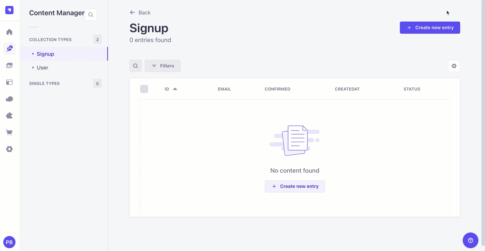
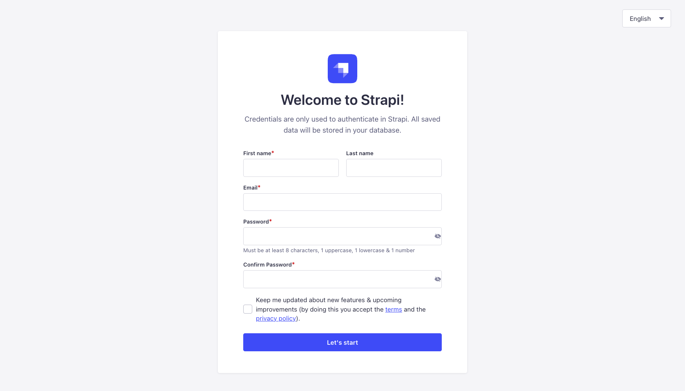
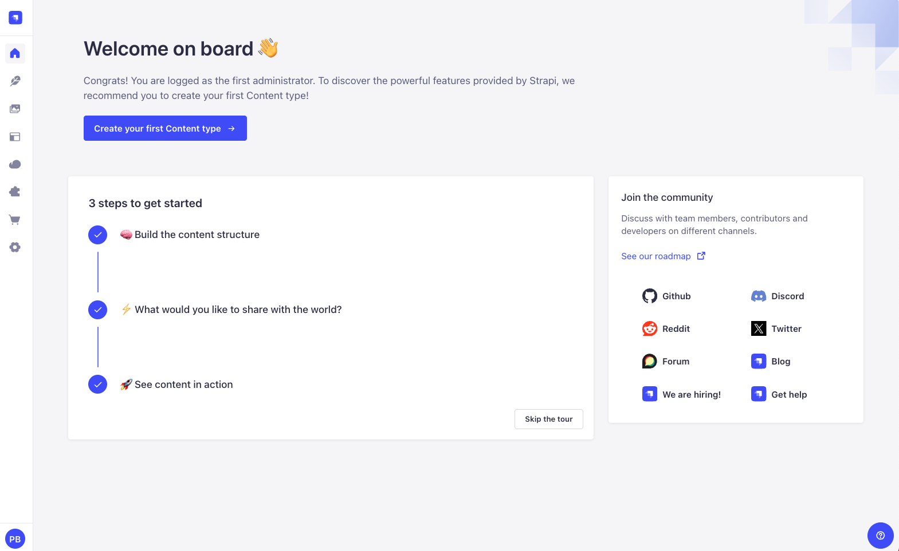
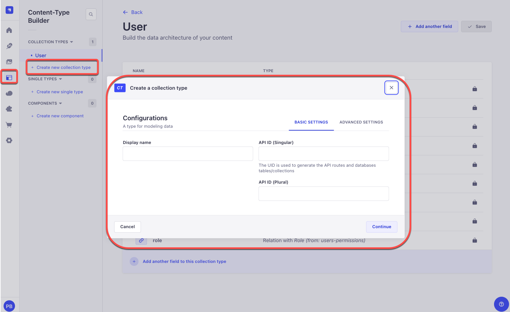
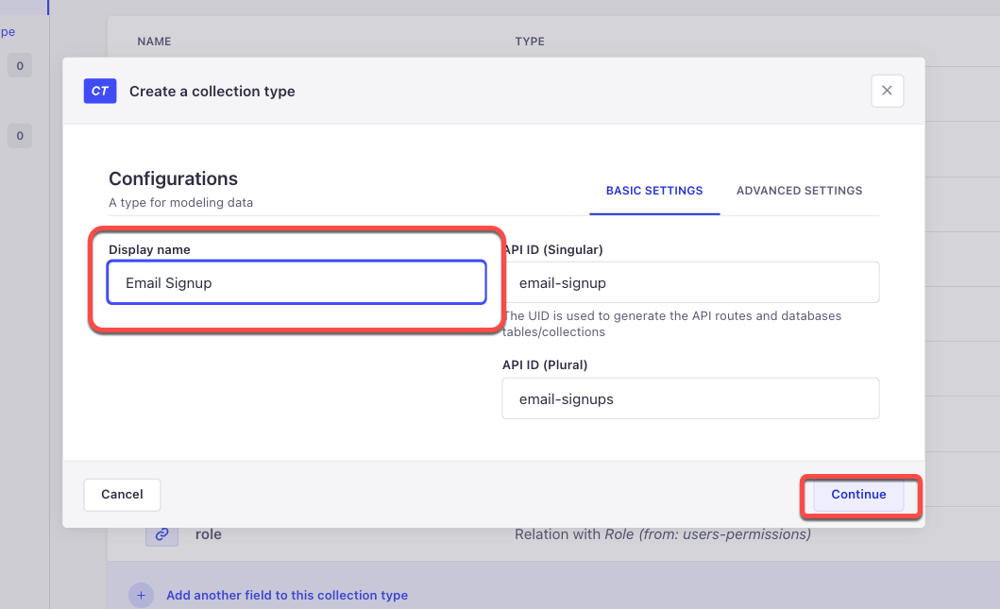
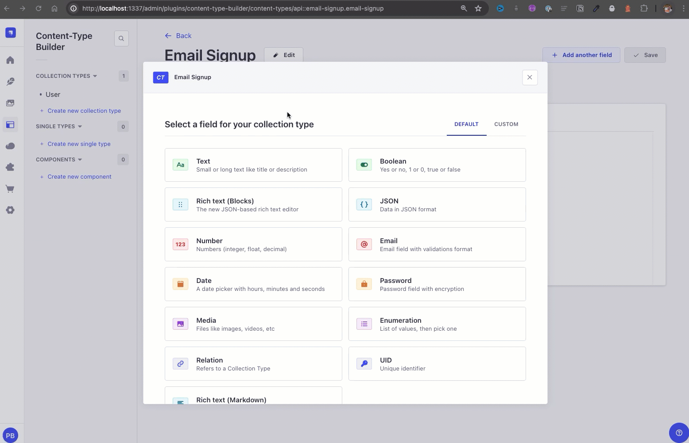
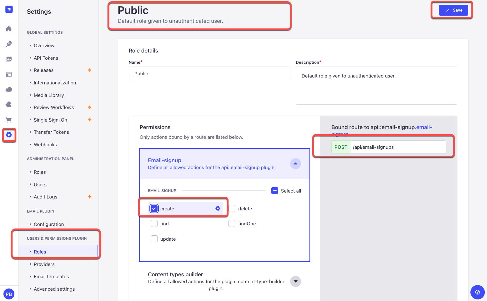

# Astro Actions With Vanilla JS and Strapi 5

Astro just recently released their Astro Actions, which is pretty awesome.

In this tutorial, we will look at creating an email capture form to showcase this feature.

Here it is in action.



We will start by building out our Astro App, and finally, we will be connected to Strapi 5 and use the release candidate.

## So Why Are We Using Astro?

Besides the fact that it is fantastic.

Astro is a fantastic web framework for creating content-rich websites like blogs, marketing sites, and online stores.

It stands out by reducing the amount of JavaScript needed, making your site faster and easier to manage.

Astro's unique "Islands" architecture is designed specifically for content, ensuring your website loads quickly and performs well in search engine rankings.

It supports popular tools like React, Vue, and Svelte, offering great flexibility for developers.

Astro is super user-friendly. It provides everything you need to build a website in one place, along with many integrations to customize it.

Astro's HTML-based syntax is easy to learn and use, even if you're not a coding expert.

Astro makes it easy to create high-quality, fast-loading websites, making it a top choice for anyone looking to build an impressive online presence.

It is a great way to create a site with just vanilla js/ts, HTML, and css.

And that is what we are going to do in this tutorial.

Use Astro without any additional frameworks. That is right, we will write vanilla js/ts.

## Setting Up Our Astro Project

You can find all the details [here](https://docs.astro.build/en/install-and-setup), but we are going to start with this simple command:

Note: first, create a folder where you will want to store this project on your local computer.

```bash
  npm create astro@latest
```

You will be asked where you would like to create your app. I will generate it in the root of my current folder and call it `frontend.`

```bash
 astro   Launch sequence initiated.
   dir   Where should we create your new project? ./frontend
```

Then, it will ask if you want to include sample files. This is the recommended option, and we are going to choose it.

```bash
  tmpl   How would you like to start your new project?
         ● Include sample files (recommended)
         ○ Use blog template
         ○ Empty
```

Then choose `yes` for the remainder options.

```bash
    ts   Do you plan to write TypeScript?
         Yes

   use   How strict should TypeScript be?
         Strict

  deps   Install dependencies?
         Yes

   git   Initialize a new git repository?
         Yes

 ██████  Project initializing...
         ■ Template copied
         ■ TypeScript customized
         ▶ Dependencies installing with npm...


╭─────╮  Houston:
│ ◠ ◡ ◠  Good luck out there, astronaut! 🚀
╰─────╯
```

Nice, we now have our local project running.

To start your project, navigate to your `frontend` folder and type `yarn dev` or `npm run dev.` Navigate to `http://localhost:4321`, and you should see the following.


Now that Astro is running let's do one more thing before diving into our tutorial: install Tailwind support. With Astro, it is easy.

You can find the details [here](https://docs.astro.build/en/guides/integrations-guide/tailwind), but we are going to use this handy command:

```bash
  npx astro add tailwind
```

This will handle all of the magic automatically. You will see the following; follow the prompts.

```bash
➜  frontend git:(main) ✗ npx astro add tailwind
✔ Resolving packages...

  Astro will run the following command:
  If you skip this step, you can always run it yourself later

 ╭──────────────────────────────────────────────────────────╮
 │ npm install @astrojs/tailwind@^5.1.0 tailwindcss@^3.4.4  │
 ╰──────────────────────────────────────────────────────────╯

✔ Continue? … yes
✔ Installing dependencies...

  Astro will generate a minimal ./tailwind.config.mjs file.

✔ Continue? … yes

  Astro will make the following changes to your config file:

 ╭ astro.config.mjs ─────────────────────────────╮
 │ import { defineConfig } from 'astro/config';  │
 │                                               │
 │ import tailwind from "@astrojs/tailwind";     │
 │                                               │
 │ // https://astro.build/config                 │
 │ export default defineConfig({                 │
 │   integrations: [tailwind()]                  │
 │ });                                           │
 ╰───────────────────────────────────────────────╯

✔ Continue? … yes

   success  Added the following integration to your project:
  - @astrojs/tailwind
```

Now that everything is all set, let's get started. If you are new to Astro, you can learn the basics by checking out the following [posts](https://strapi.io/blog/astro-and-strapi-website-tutorial-part-1-intro-to-astro).

Excellent; now that our app is ready, let's get started.

## Create a Submit Form In Astro

We will start by building out our submission form. We will keep it simple.

Navigate to the `src/pages/index inside your Astro project. Astro's file and replace all of the code with the following.

```astro
---
// This runs on the server when the site is built
import Layout from "../layouts/Layout.astro";
---

<!-- This is the HTML that gets sent to the browser -->
<Layout title="Home">
  <div class="sm:px-8 m-24 md:m-28">
    <div class="mx-auto w-full max-w-7xl lg:px-8 flex justify-center">
      <div class="flex flex-col gap-16"></div><div
        class="space-y-10 lg:pl-16 xl:pl-24"
      >
        <div
          class="rounded-2xl border border-zinc-100 p-6 dark:border-zinc-700/40"
        >
          <h2
            class="flex text-sm font-semibold text-zinc-900 dark:text-zinc-100"
          >
            <svg
              viewBox="0 0 24 24"
              fill="none"
              stroke-width="1.5"
              stroke-linecap="round"
              stroke-linejoin="round"
              aria-hidden="true"
              class="h-6 w-6 flex-none"
              ><path
                d="M2.75 7.75a3 3 0 0 1 3-3h12.5a3 3 0 0 1 3 3v8.5a3 3 0 0 1-3 3H5.75a3 3 0 0 1-3-3v-8.5Z"
                class="fill-zinc-100 stroke-zinc-400 dark:fill-zinc-100/10 dark:stroke-zinc-500"
              ></path><path
                d="m4 6 6.024 5.479a2.915 2.915 0 0 0 3.952 0L20 6"
                class="stroke-zinc-400 dark:stroke-zinc-500"></path></svg
            ><span class="ml-3">Stay up to date</span>
          </h2><p class="mt-2 text-sm text-zinc-600 dark:text-zinc-400">
            Get notified when I publish something new, and unsubscribe at any
            time.
          </p>

          <!-- Add you form here -->
        </div>
      </div>
    </div>
  </div>
</Layout>

<style>
	/* This is where you can add your scoped CSS styles */
</style>

<script>
	// This is where you can add your client-side JavaScript code
</script>

```

Notice that we are importing our `Layout` component at the top; let's navigate into it and replace the code within the `<body>` tags with the following.

```astro
<body class="flex min-h-screen bg-zinc-50 dark:bg-black">
  <div class="flex w-full">
    <div class="relative flex w-full flex-col">
      <main class="flex-auto"><slot /></main>
    </div>
  </div>
</body>
```

Remove all the styles between the `<styles>` tags; we won't need them since we installed Tailwind.

Now run `yarn dev,` and you should see the following.


Before we create our form component. Let's quickly revisit our `Layout` component.

The big takeaway is that we use the `Layout` component as a wrapper that takes in children. We need to use Astro's `<slot />` tag to render the children.

You can learn more details [here](https://docs.astro.build/en/basics/astro-components/#slots)

Basic example.

Wrapper component, in our case it is the `Layout.astro`

```astro
---
interface Props {
  title: string;
}

const { title } = Astro.props;
---

<!doctype html>
<html lang="en">
  <head>
    <meta charset="UTF-8" />
    <meta name="description" content="Astro description" />
    <meta name="viewport" content="width=device-width" />
    <link rel="icon" type="image/svg+xml" href="/favicon.svg" />
    <meta name="generator" content={Astro.generator} />
    <title>{title}</title>
  </head>
  <body class="flex min-h-screen bg-zinc-50 dark:bg-black">
    <div class="flex w-full">
      <div class="relative flex w-full flex-col">
        <main class="flex-auto">
          <slot /> <!-- children will go here -->
        </main>
      </div>
    </div>
  </body>
</html>

```

When we import our **Layout** component, everything we place between the `<Layout></Layout>` will be rendered via the `<slot/>` tag.

Here is our example in our `index.astro` page.

```astro
<Layout title="Home">
  <div class="sm:px-8 m-24 md:m-28">
   <!-- rest of our code -->
  </div>
</Layout>

```

## What are Astro JS Components?

Astro components are modular, reusable pieces of code representing user interface parts, like headers, footers, cards, etc.

Similar to frameworks like React or Vue, Astro uses a component-based architecture, allowing developers to break down the UI into manageable, reusable parts.

Astro components can be written using various frontend frameworks, such as React, Vue, Svelte, or plain HTML and JavaScript, which we will do in this tutorial.

This flexibility allows developers to choose the best tool for their needs or mix and match frameworks within the same project.

Astro uses an "islands architecture," where only interactive components (islands) are hydrated and made interactive on the client side. This approach minimizes JavaScript sent to the browser, improving performance.

Let's build our form component.

Navigate to your `component` folder and create a file called `EmailSignUp.astro.`

And add the following code.

```astro
<form class="mt-6" id="email-form">
  <div class="w-full flex">
    <input
      id="email"
      name="email"
      type="email"
      placeholder="Email address"
      aria-label="Email address"
      class="min-w-0 flex-auto appearance-none rounded-md border border-zinc-900/10 bg-white px-3 py-[calc(theme(spacing.2)-1px)] shadow-md shadow-zinc-800/5 placeholder:text-zinc-400 focus:border-teal-500 focus:outline-none focus:ring-4 focus:ring-teal-500/10 sm:text-sm dark:border-zinc-700 dark:bg-zinc-700/[0.15] dark:text-zinc-200 dark:placeholder:text-zinc-500 dark:focus:border-teal-400 dark:focus:ring-teal-400/10"
    />

    <button
      class="inline-flex items-center gap-2 justify-center rounded-md py-2 px-3 text-sm outline-offset-2 transition active:transition-none bg-zinc-800 font-semibold text-zinc-100 hover:bg-zinc-700 active:bg-zinc-800 active:text-zinc-100/70 dark:bg-zinc-700 dark:hover:bg-zinc-600 dark:active:bg-zinc-700 dark:active:text-zinc-100/70 ml-4 flex-none"
      type="submit"
    >
      Join
    </button>
  </div>
</form>
```

This is where all of our magic will happen. But first, navigate to your `index. Astro` file, and let's import the component and add it to our code.

```astro
  import EmailSignUp from "../layouts/EmailSignUp.astro";
```

And add the following.

```
  <EmailSignUp />
```

The updated code should look like the following.

```astro
---
// This runs on the server when the site is built
import Layout from "../layouts/Layout.astro";
import EmailSignUp from "../layouts/EmailSignUp.astro";
---

<!-- This is the HTML that gets sent to the browser -->
<Layout title="Home">
  <div class="sm:px-8 m-24 md:m-28">
    <div class="mx-auto w-full max-w-7xl lg:px-8 flex justify-center">
      <div class="flex flex-col gap-16"></div><div
        class="space-y-10 lg:pl-16 xl:pl-24"
      >
        <div
          class="rounded-2xl border border-zinc-100 p-6 dark:border-zinc-700/40"
        >
          <h2
            class="flex text-sm font-semibold text-zinc-900 dark:text-zinc-100"
          >
            <svg
              viewBox="0 0 24 24"
              fill="none"
              stroke-width="1.5"
              stroke-linecap="round"
              stroke-linejoin="round"
              aria-hidden="true"
              class="h-6 w-6 flex-none"
              ><path
                d="M2.75 7.75a3 3 0 0 1 3-3h12.5a3 3 0 0 1 3 3v8.5a3 3 0 0 1-3 3H5.75a3 3 0 0 1-3-3v-8.5Z"
                class="fill-zinc-100 stroke-zinc-400 dark:fill-zinc-100/10 dark:stroke-zinc-500"
              ></path><path
                d="m4 6 6.024 5.479a2.915 2.915 0 0 0 3.952 0L20 6"
                class="stroke-zinc-400 dark:stroke-zinc-500"></path></svg
            ><span class="ml-3">Stay up to date</span>
          </h2><p class="mt-2 text-sm text-zinc-600 dark:text-zinc-400">
            Get notified when I publish something new, and unsubscribe at any
            time.
          </p>

          <!-- Add you form here -->
					 <EmailSignUp />
        </div>
      </div>
    </div>
  </div>
</Layout>

<style>
	/* This is where you can add your scoped CSS styles */
</style>

<script>
	// This is where you can add your client-side JavaScript code
</script>

```

If you restart your app, you will see the following.


But clicking the button won't do anything. That is okay. We will fix this in the next section using vanilla Javascript. What?!! Vanilla Javascript. Who does that?

Yes, let's see if we still remember how to do it. Sometimes, using a framework is overkill, especially if you have a static site and need one form to capture email.

Of course, I am joking. We can use React here if we like, but that is the beauty of Astro: It gives us the option to choose.

## Making Vanilla Javascript Cool Again

What's incredible about Astro is that we can add Javascript directly via the `<script>` tag; you can either write all of the code there or in a separate file and then import it within the script tag.

Add the following to our `EmailSignUp.astro` after our HTML code.

```ts
<script>
  import { actions } from "astro:actions";
  import { isInputError } from "astro:actions";

  function clearPreviousMessage(id: string) {
    const messageElement = document.getElementById(id);
    if (messageElement) {
      messageElement.remove();
    }
  }

  function addMessageElement(
    message: string,
    type: "error" | "success",
    element: HTMLElement
  ) {
    const p = document.createElement("p");

    p.id = "message";
    p.className = `message ${type === "success" ? "text-teal-300" : "text-pink-300"} mt-2 px-2`;
    p.innerText = message;
    form.appendChild(p);
    p.innerText = message;
    element.appendChild(p);
  }

  function clearInput(id: string) {
    const emailInput = document.getElementById(id) as HTMLInputElement;
    if (emailInput) emailInput.value = "";
  }

  function renderMessage(error: any, data: any, form: HTMLFormElement) {
    if (error && isInputError(error)) {
      const message = error.fields.email && error.fields.email[0];
      addMessageElement(message || "", "error", form);
    } else {
      if (data?.strapiErrors) {
        const message = data?.strapiErrors.message;
        addMessageElement(message, "error", form);
      } else {
        const message = "Form submitted, thank you.";
        clearInput("email");
        addMessageElement(message, "success", form);
      }
    }
  }

  const form = document.getElementById("email-form") as HTMLFormElement;

  async function handleFormSubmit(e: Event) {
    e.preventDefault();

    const formData = new FormData(form);

    const { data, error } = await actions.email.safe(formData);

    clearPreviousMessage("message");
    renderMessage(error, data, form);
  }

  form.addEventListener("submit", handleFormSubmit);
</script>
```

Look at the beautiful vanilla Javascript. If it has been a while, that's okay. This is one of the reasons I started using Astro: so I can have the opportunity to write some vanilla Javascript. And if I need more, I can always bring in a React component.

Let's break down each part of the code above.

### Imports:

```ts
import { actions } from "astro:actions";
import { isInputError } from "astro:actions";
```

This is where we will import our actions, we are yet to create them, but this is something we will do next.

### Helper Functions

**clearPreviousMessage function**

```ts
function clearPreviousMessage(id: string) {
  const messageElement = document.getElementById(id);
  if (messageElement) {
    messageElement.remove();
  }
}
```

This function removes a message element from the DOM if it exists. It is used to clear any previous messages before displaying a new one.

**addMessageElement function**

```ts
function addMessageElement(
  message: string,
  type: "error" | "success",
  element: HTMLElement
) {
  const p = document.createElement("p");

  p.id = "message";
  p.className = `message ${
    type === "success" ? "text-teal-300" : "text-pink-300"
  } mt-2 px-2`;
  p.innerText = message;
  form.appendChild(p);
  p.innerText = message;
  element.appendChild(p);
}
```

This function creates a new <p> element with a specified message and style (either error or success) and appends it to a given HTML element.

**clearInput function**

```ts
function clearInput(id: string) {
  const emailInput = document.getElementById(id) as HTMLInputElement;
  if (emailInput) emailInput.value = "";
}
```

This function clears the value of an input field identified by its id.

**renderMessage function**

```ts
function renderMessage(error: any, data: any, form: HTMLFormElement) {
  if (error && isInputError(error)) {
    const message = error.fields.email && error.fields.email[0];
    addMessageElement(message || "", "error", form);
  } else {
    if (data?.strapiErrors) {
      const message = data?.strapiErrors.message;
      addMessageElement(message, "error", form);
    } else {
      const message = "Form submitted, thank you.";
      clearInput("email");
      addMessageElement(message, "success", form);
    }
  }
}
```

This function determines whether an error or success message should be displayed based on the presence of error and data parameters. It uses addMessageElement to display the appropriate message.

### From Handling

**Form element selection**

```ts
const form = document.getElementById("email-form") as HTMLFormElement;
```

Selects the form element by its id (email-form) and casts it as an HTMLFormElement.

**handleFormSubmit function**

```ts
async function handleFormSubmit(e: Event) {
  e.preventDefault();

  const formData = new FormData(form);

  const { data, error } = await actions.email.safe(formData);

  clearPreviousMessage("message");
  renderMessage(error, data, form);
}
```

This function handles the form submission event. It prevents the default form submission, gathers form data, and sends it using actions.email.safe(). It then clears any previous messages and calls renderMessage to display the appropriate message based on the response.

**Event Listener**

```ts
form.addEventListener("submit", handleFormSubmit);
```

Adds an event listener to the form that triggers handleFormSubmit when the form is submitted.

Before we can test our form, we need to create an Astro Action.

## Implementing Astro Actions In Astro

Finally, let's examine how to use astro actions. This is an experimental feature, so we must first enable it. To learn more about Astro's actions, check out the following [post](https://astro.build/blog/astro-480/#experimental-astro-actions).

Our first step is to update our `Astro.config.mjs` file with the following.

```mjs
import { defineConfig } from "astro/config";

import tailwind from "@astrojs/tailwind";

// https://astro.build/config
export default defineConfig({
  integrations: [tailwind()],
  output: "hybrid", // or 'server'
  experimental: {
    actions: true,
  },
});
```

Now, let's create a new folder in the `src` directory called `actions,` add the `index.ts` file, and paste it into the following code.

```ts
import { defineAction, z } from "astro:actions";

export const server = {
  email: defineAction({
    accept: "form",
    input: z.object({
      email: z
        .string({ message: "This field has to be filled." })
        .email("This is not a valid email."),
    }),

    handler: async (formData) => {
      // do something here
      console.log(formData);
    },
  }),
};
```

Here, we define a simple Astro action; what is fantastic is that we can do validation via zod.

If we were to submit our form with any email, our action would return the zod validation error. Which is awesome.

But if we provide a valid email, you can see that we can console log our email.


Nice. We are now getting our email. Next, let's set up Strapi 5 and connect everything.

## Getting Started With Strapi 5

Did you know we recently released the Strapi 5 "release candidate"? This is your chance to take it for a spin and help us improve with your feedback.

You can check out the new docs [here](https://docs-next.strapi.io/dev-docs/whats-new).

Let's start with the following command. We will use the `--quickstart` flag to get us started with the SQLite database.

```bash
  npx create-strapi@rc backend --quickstart
```

```bash
Create a free account on Strapi Cloud and benefit from:

- ✦ Blazing-fast ✦ deployment for your projects
- ✦ Exclusive ✦ access to resources to make your project successful
- An ✦ Awesome ✦ community and full enjoyment of Strapi's ecosystem

Start your 14-day free trial now!


? Please log in or sign up.
  Login/Sign up
❯ Skip
```

When creating your project, you will be prompted to sign in to Strapi Cloud; we will skip this option for now.

But whenever you want to deploy your project quickly, Strapi Cloud is the way to go. You can learn more [here](https://strapi.io/cloud)

Once all the dependencies are installed, your app will start, and you will see the following screen.



Once you log in, you will be greeted by the dashboard.



Let's now create our first collection type to store the emails that will be captured by our form.

Navigate to the `Content-Type Builder` and click `Create new collection type`.



Now, let's fill out the following fields.

**Display Name:** Email Signup

Then click on continue.



We will add one text field called `email` and make it unique.



Finally, we must enable the endpoint to allow us to create entries. We can do this by navigating to `Settings => Users Permission => Roles => Public,` selecting our collection type `Email Signup`, and checking the create check box.

Please save your changes. Now that this is done, we can post a request to the following URL path: `https://localhost:1337/api/email-signups`.



Nice; finally, we have to finish up the code in our Astro project to make the request to Strapi and pass the email contact form data.

## Making A POST Request To Strapi via Astro Action

In our Astro project, navigate to our `actions` folder and examine the `index.ts` file.

At the top, let's define a function that will call Strapi API using the following code

```ts
export async function mutateData(method: string, path: string, payload?: any) {
  const baseUrl = import.meta.env.PUBLIC_STRAPI_URL || "http://localhost:1337";
  const url = new URL(path, baseUrl);

  const authToken = false;

  const headers: any = {
    "Content-Type": "application/json",
  };

  if (authToken) {
    headers["Authorization"] = `Bearer ${authToken}`;
  }

  try {
    const response = await fetch(url.href, {
      method: method,
      headers,
      body: JSON.stringify({ ...payload }),
    });
    const data = await response.json();
    return data;
  } catch (error) {
    console.log("error", error);
    throw error;
  }
}
```

The above function is a general function that I use in many projects to make requests.

We are not using auth, so I hardcoded it to false. Still, you can extend the functionality to add authenticated requests via JWT token.

Now that we have our function, we can use it in our action to make a **POST** request to our Strapi endpoint.

Inside our handler function, let's make the following change.

```ts

 handler: async (formData) => {
      // insert comments in db
      console.log(formData);

      const payload: Payload = {
        data: {
          email: formData.email,
        },
      };

      const responseData = await mutateData("POST", "/api/email-signups", payload);

      if (!responseData) {
        return {
          strapiErrors: null,
          message: "Ops! Something went wrong. Please try again.",
        };
      }

      if (responseData.error) {
        return {
          strapiErrors: responseData.error,
          message: "Failed to Register.",
        };
      }

      return {
        message: "Form submitted, thank you.",
        data: responseData,
        strapiErrors: null,
      };
    },

```

After we call the `mutateData` function, we check to see if the request fails and for Strapi-specific API errors.

For instance, we set the email field as unique. That means when the user tries to add their email more than once in the contact form, we will return a Strapi error saying that the email has to be unique.

We will see this in action in just a moment.

The completed code should look like the following.


```ts
import { defineAction, z } from "astro:actions";

export async function mutateData(method: string, path: string, payload?: any) {
  const baseUrl = import.meta.env.PUBLIC_STRAPI_URL || "http://localhost:1337";
  const url = new URL(path, baseUrl);

  const authToken = false;

  const headers: any = {
    "Content-Type": "application/json",
  };

  if (authToken) {
    headers["Authorization"] = `Bearer ${authToken}`;
  }

  try {
    const response = await fetch(url.href, {
      method: method,
      headers,
      body: JSON.stringify({ ...payload }),
    });
    const data = await response.json();
    return data;
  } catch (error) {
    console.log("error", error);
    throw error;
  }
}

interface Payload {
  data: {
    email: string;
  };
}

export const server = {
  email: defineAction({
    accept: "form",
    input: z.object({
      email: z
        .string({ message: "This field has to be filled." })
        .email("This is not a valid email."),
    }),

    handler: async (formData) => {
      // insert comments in db
      console.log(formData);

      const payload: Payload = {
        data: {
          email: formData.email,
        },
      };

      const responseData = await mutateData(
        "POST",
        "api/email-signups",
        payload
      );

      if (!responseData) {
        return {
          strapiErrors: null,
          message: "Ops! Something went wrong. Please try again.",
        };
      }

      if (responseData.error) {
        return {
          strapiErrors: responseData.error,
          message: "Failed to Register.",
        };
      }

      return {
        message: "Form submitted, thank you.",
        data: responseData,
        strapiErrors: null,
      };
    },
  }),
};
```

Make sure that your Strapi and Astro apps are running, and let's test out our form.


Nice, everything is working as expected. We can submit our contact form, but we see an error if we try to submit the form with an already submitted email.

## Conclusion

In this tutorial, we've integrated Astro Actions with a vanilla JavaScript email capture form, seamlessly connecting it to Strapi 5. 

Following these steps, you should understand how to set up an Astro project, implement and use Astro Actions, and integrate them with Strapi for backend functionality.

Astro's flexibility allows you to write clean, performant code without relying heavily on frameworks, making it a great choice for content-rich websites. 

Using Astro's "Islands" architecture and integrating with tools like Strapi, you can create fast, SEO-friendly sites with dynamic content capabilities. 

We hope this guide has been helpful and that you feel empowered to create more advanced and interactive web applications using Astro and Strapi. Happy coding!

You can find the project repo [here](https://github.com/PaulBratslavsky/astro-actions-blog-example).

If you have additional Strapi questions. Come hang out with us for Strapi Open Office hours.

**Morning Session:**
Join us at 4 AM CST (9:00 AM GMT) for our new early bird session. Perfect for our global community members!

**Afternoon Session:**
Remember our regular session at 12:30 PM CST (6:30 PM GMT). It's an excellent time for an afternoon break and chat!
